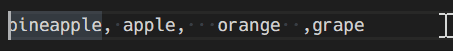
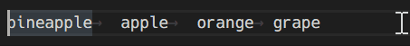
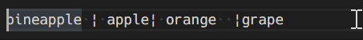
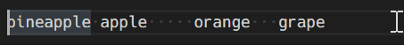
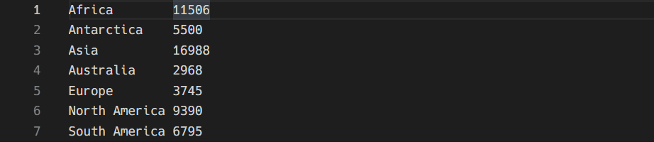
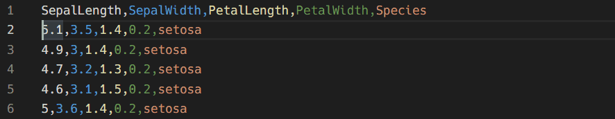
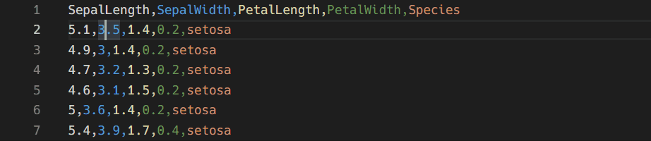
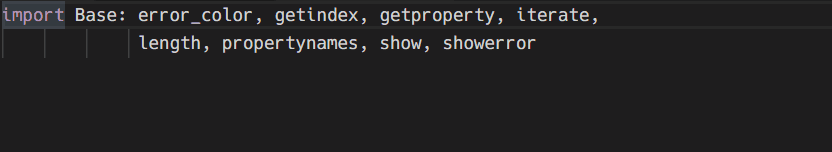

# Smart Sort

<!-- markdownlint-configure-file
{
  "no-duplicate-header": false,
  "no-inline-html": false
}
-->

&nbsp;

Sort CSV-like words or lines in [Visual Studio Code](https://code.visualstudio.com).

## Summary

Smart Sort allows you to:

1. Sort words separated by comma, tab, pipe (`|`) or space
2. Sort lines by comparing selected parts of them, or entire content of them

Smart Sort chooses how and what to sort according to the selection state
so there are just 2 commands provided: one for sorting ascending order,
one for sorting descending order.

Note that Smart Sort recognizes numeric value (e.g.: `2` comes
before `10`).

## Key bindings

| Command                    | Shortcut                                                       |
| -------------------------- | -------------------------------------------------------------- |
| `smartSort.SortAscending`  | <kbd>Ctrl+Alt+R</kbd> (mac: <kbd>Cmd+Ctrl+R</kbd>)             |
| `smartSort.SortDescending` | <kbd>Ctrl+Alt+Shift+R</kbd> (mac: <kbd>Cmd+Ctrl+Shift+R</kbd>) |

Those key bindings will be enabled by default.

## Configuration

- `smartSort.preferWordSorting`
  - When multiple lines are selected by a single selection, setting `true` to
    this configuration makes Smart Sort to sort words spread over the lines,
    instead of sorting the lines. See
    [explanation](#sorting-words-spread-over-multiple-lines)
    below for detail. (default: `false`)

## Sorting words

To sort words, just select some words and hit <kbd>Ctrl+Alt+R</kbd>
(or <kbd>Cmd+Ctrl+R</kbd> on mac.)

Smart Sort automatically recognizes the word separator. In order of priority,
supported separators are:

1. Comma (`U+0013`)
2. Tab (`U+0009`)
3. Pipe (`U+007C`)
4. Space (`U+0020`)

On sorting words, word separators among them will be normalized. Strictly
writing, whitespace characters surrounding the first word separator will be
treated as part of the separator and they will be used to separate sorted words.

Here are some example animations:

- Comma 
  
- Tab 
  
- Pipe 
  
- Space 
  

## Sorting lines

To sort lines, select multiple lines and hit <kbd>Ctrl+Alt+R</kbd>
(or <kbd>Cmd+Ctrl+R</kbd> on mac.)

If you select portions of lines by using
[multple selections (multi-cursor)](https://code.visualstudio.com/docs/editor/codebasics#_multiple-selections-multicursor),
the lines which are touched by the selection range will be sorted by comparing
the selected parts.
This is useful if you want to sort on arbitrary column of visually aligned text
data such as output of
[`ps` command](<https://en.wikipedia.org/wiki/Ps_(Unix)>)
or CSV data.

Here are some example animations:

1. Sort visually aligned lines by specific "column" 
   
2. Sort lines by entire content (CSV colorized with
   [Rainbow CSV](https://marketplace.visualstudio.com/items?itemName=mechatroner.rainbow-csv)) 
   
3. Sort lines by comparing selected parts 
   

## Sorting words spread over multiple lines

If `smartSort.preferWordSorting` is configured as `true`, Smart Sort will sort
words instead of lines under the condition shown below:

- there is only one selection range (not using multi-cursor), AND
- both the start and end of the selection range are NOT placed at a beginning
  of a line (placed in a middle of a line or at the end of a line).

In this mode, sorted words will be reflowed. In other words, the original
indentation and line widths will remain unchanged. (for example, the
indentation characters of the second line is kept unchanged in the example
animation below).

Note that if you place both the start and end of the selection range are placed
at a beginning of a line, you can always sort lines even if you set
`true` to `smartSort.preferWordSorting`.

Here is an example animation:

- Sorting `import` target in Julia language: 
   
  In this example, we don't need to care about where to insert a new target; just
  appending one and sorting them will move it to the right place.

## Historical Background

Previously the name of this extension was "Stable Sort". Here is why I wanted
and created an extension which uses stable sort algorithm.

Back when Visual Studio Code was version 1.27.2, it have used unstable sort
algorithm. This means that sorting textually identical words or lines may
change those order. This behavior will not be a problem in most cases since
swapping those is not a change by all means.

Unfortunately, I encountered an exceptional case. In Japanese locale, an ASCII
digit character and its counter part in
[fullwidth forms](https://www.unicode.org/charts/PDF/UFF00.pdf)
are treated as equal so the order of words like below changed every time I sort
them:

    2型糖尿病
    ２型糖尿病

This behavior was very annoying when I was compositing dictionary data since I
cannot normalize entries by simple sorting. Obviously an extension which allows
me to sort entries using stable sort algorithm solves the problem.
So, I created one.
